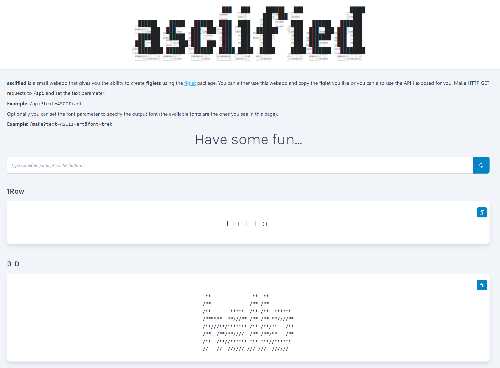

```
                             ███   ███     ██████   ███               █████
                            ░░░   ░░░     ███░░███ ░░░               ░░███ 
  ██████    █████   ██████  ████  ████   ░███ ░░░  ████   ██████   ███████ 
 ░░░░░███  ███░░   ███░░███░░███ ░░███  ███████   ░░███  ███░░███ ███░░███ 
  ███████ ░░█████ ░███ ░░░  ░███  ░███ ░░░███░     ░███ ░███████ ░███ ░███ 
 ███░░███  ░░░░███░███  ███ ░███  ░███   ░███      ░███ ░███░░░  ░███ ░███ 
░░████████ ██████ ░░██████  █████ █████  █████     █████░░██████ ░░████████
 ░░░░░░░░ ░░░░░░   ░░░░░░  ░░░░░ ░░░░░  ░░░░░     ░░░░░  ░░░░░░   ░░░░░░░░ 
```

# asciified

A simple ASCII Art API with a good-looking Web App.

[](https://www.javascript.com)
[](https://github.com/cybersecsi/RAUDI/blob/main/LICENSE)

## Web App
The web app is created using:
- [React](https://reactjs.org/)
- [Tailwind CSS](https://tailwindcss.com)

And using the following packages:
- [figlet](https://www.npmjs.com/package/figlet)
- [dom-to-image](https://www.npmjs.com/package/dom-to-image)
- [react-icons](https://www.npmjs.com/package/react-icons)
- [react-github-corner](https://www.npmjs.com/package/react-github-corner)
- [use-clipboard-copy](https://www.npmjs.com/package/use-clipboard-copy)

<p align="center">
  
</p>

In the webapp the user can type something and see the **asciified** version in **every font**. The user can also easily copy the text and, if the text is too long, it gets converted into an image using *dom-to-image*. Anyway it is still copyable.

## REST API
### [GET] /api
#### Parameters
- **text**: the text to asciifiy
- **font** (optional): the font
#### Returns
The asciified text.

### [GET] /api/fonts
#### Parameters
None
#### Returns
The list of *available fonts*

## License
**asciified** is an open-source and free software released under the [GNU GPL v3](https://github.com/thelicato/asciified/blob/main/LICENSE).